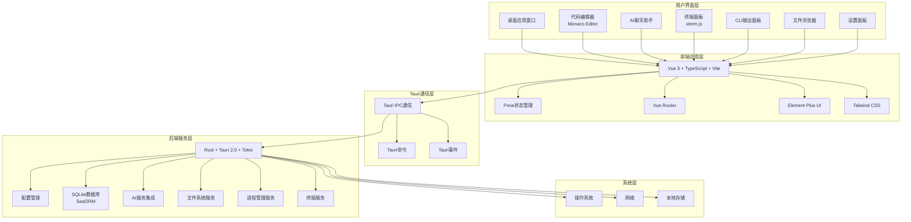

# 项目架构总览

## 项目基本信息
- **项目名称**: Code AI Assistant
- **项目类型**: 桌面应用程序（基于Tauri）
- **主要功能**: 集成代码编辑器、AI聊天助手、CLI输出和终端功能
- **主要语言**: TypeScript (前端), Rust (后端)
- **架构风格**: 前后端分离 + 分层架构 + 组件化架构
- **开发状态**: 活跃开发中（Git状态干净）
- **许可证**: Apache 2.0
- **生成时间**: 2025-12-17

## 系统架构图

## 核心组件

### 1. 代码编辑器组件
- **职责**: 提供类似VS Code的代码编辑体验
- **技术**: Monaco Editor集成
- **功能**: 语法高亮、代码折叠、多光标编辑、查找/替换
- **位置**: `frontend/src/components/editor/`

### 2. AI聊天助手组件
- **职责**: 提供AI对话和编程辅助
- **功能**: 多模型支持、文件关联上下文、Markdown预览、对话历史
- **位置**: `frontend/src/components/chat/`

### 3. 终端组件
- **职责**: 提供系统终端功能
- **技术**: xterm.js集成
- **功能**: 多标签页、命令执行、复制/粘贴、字体调整
- **位置**: `frontend/src/components/terminal/`

### 4. CLI输出组件
- **职责**: 显示实时CLI输出日志
- **功能**: 时间戳显示、搜索过滤、暂停/继续、日志级别
- **位置**: `frontend/src/components/output/`

### 5. 文件浏览器组件
- **职责**: 管理本地文件系统
- **功能**: 树形导航、右键菜单、拖拽支持、文件搜索
- **位置**: `frontend/src/components/file-explorer/`

### 6. 设置管理组件
- **职责**: 管理应用配置
- **功能**: 工作区管理、CLI工具路径、环境变量、AI模型配置
- **位置**: `frontend/src/components/settings/`

### 7. 后端服务组件
- **Tauri IPC层**: 前后端通信 (`src-tauri/src/tauri/`)
- **配置管理**: 应用配置加载和验证 (`src-tauri/src/config/`)
- **核心逻辑**: 应用状态和生命周期管理 (`src-tauri/src/core/`)
- **数据库层**: SQLite数据库操作 (`src-tauri/src/database/`)
- **业务服务**: AI、终端、文件系统服务 (`src-tauri/src/services/`)

## 技术栈概览

### 前端技术栈
- **框架**: Vue 3.5.24 + TypeScript 5.9.3 + Composition API
- **构建工具**: Vite 7.3.0
- **UI组件**: Element Plus 2.8.0 + Tailwind CSS 4.1.18
- **状态管理**: Pinia 3.0.0
- **编辑器**: Monaco Editor 0.50.0
- **终端**: @xterm/xterm 5.5.0 + 相关插件
- **路由**: Vue Router 4.0.0
- **工具库**: lodash-es, dayjs, marked

### 后端技术栈
- **框架**: Tauri 2.0.0 + Rust
- **异步运行时**: Tokio 1.0
- **数据库**: SQLite + SeaORM 0.12 + SQLx 0.7
- **HTTP客户端**: Reqwest 0.12
- **序列化**: Serde 1.0 + serde_json
- **配置管理**: Config 0.13 + TOML
- **错误处理**: Anyhow 1.0 + Thiserror 1.0
- **日志**: tracing

### 开发工具链
- **包管理器**: pnpm
- **代码质量**: ESLint 8.57.0 + Prettier 3.7.4 + Stylelint 16.26.1
- **Git钩子**: lint-staged 16.2.7
- **构建工具**: Vue-TSC + Cargo
- **IDE配置**: VSCode扩展和设置

## 关键特性

### 1. 一体化开发环境
- 代码编辑器、终端、AI助手、CLI输出集中在一个界面
- 支持多语言代码编辑（Monaco Editor）
- 实时CLI输出和系统终端访问

### 2. AI辅助编程
- 多AI模型支持（Claude、GPT、Gemini等）
- 文件上下文关联
- Markdown格式聊天和预览
- 对话历史管理

### 3. 文件管理
- 树形文件浏览器
- 右键菜单操作（新建、重命名、删除等）
- 拖拽文件/文件夹支持
- 文件搜索功能

### 4. 配置管理
- 工作区隔离和切换
- CLI工具路径配置（Node.js、Python、Git等）
- 环境变量管理（支持加密）
- AI模型和密钥管理
- Code CLI配置管理

### 5. 性能与安全
- Rust后端提供高性能本地操作
- Tauri安全沙箱机制
- 类型安全的前后端通信
- 应用级权限控制

### 6. 跨平台支持
- 支持Windows、macOS、Linux
- 原生UI体验
- 自动更新机制

## 架构优势

1. **现代化技术栈**: 使用Vue 3、TypeScript、Rust等最新技术
2. **性能优化**: Rust后端提供高性能，Vite提供快速开发体验
3. **安全性**: Tauri安全沙箱，自定义CSP策略
4. **可扩展性**: 模块化设计，支持Tauri插件
5. **开发体验**: 完整的代码质量工具链，统一代码风格
6. **用户体验**: 响应式设计，实时更新，类似IDE的界面

## 项目状态

- **Git状态**: 干净（无未提交更改）
- **最近提交**:
  - `448bf84` - 标准化代码格式化和改进一致性
  - `483a747` - 更新许可证，调整开发URL，修改窗口尺寸
  - `8a6630b` - 初始提交
- **开发模式**: 活跃开发中
- **部署状态**: 支持开发和生产构建

---
*文档生成时间: 2025-12-17*
*基于Code AI Assistant项目架构分析*